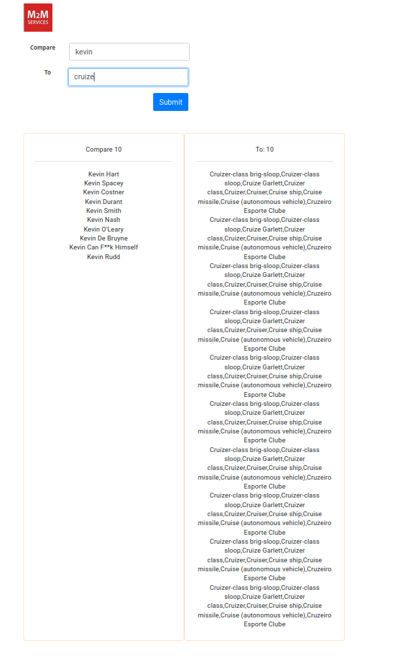
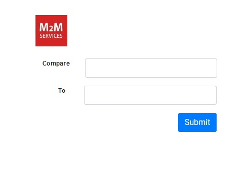
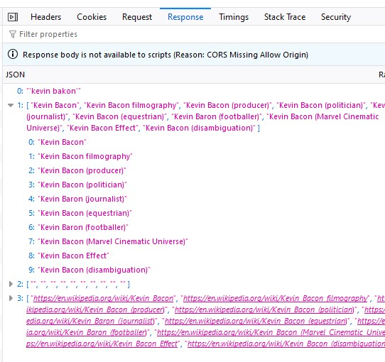

# M2MWikiCountLinks

;
;

This project was generated with [Angular CLI](https://github.com/angular/angular-cli) version 18.2.6.

## Development server

Run `ng serve` for a dev server. Navigate to `http://localhost:4200/`. The application will automatically reload if you change any of the source files.

PLEASE REFFER TO `formatting-components` branch for current updates.
THERE ARE MORE THEN ONE BRANCHES. 
progress so far:

[x] api call to static endpoint

[x] button with submit action on it

[x] input field 1 and 2

[x] component for representation

[ ] algorithm for api comparison

ALGORITHM PHASE: NOT DONE

### ALGORITHM APROACH

> 
- use the api link *https://en.wikipedia.org/w/api.php?action=opensearch&format=json&gsrnamespace=0&gsrlimit=5&search=%27${searchTerm}%27&origin=**
- it returns an array the fourth member of the arry have links in this format *https://en.wikipedia.org/wiki/Kevin_Rudd* so at the end there could be the search term's page
-  go 2-3 levels down this page *https://en.wikipedia.org/wiki/Kevin_Rudd"* if Kevin_Rudd is not the answer and check the results of the comming array for our search term. This should be recursively done.
- put limit of the search requiests 2-3 levels deep in the recursion. 

### end