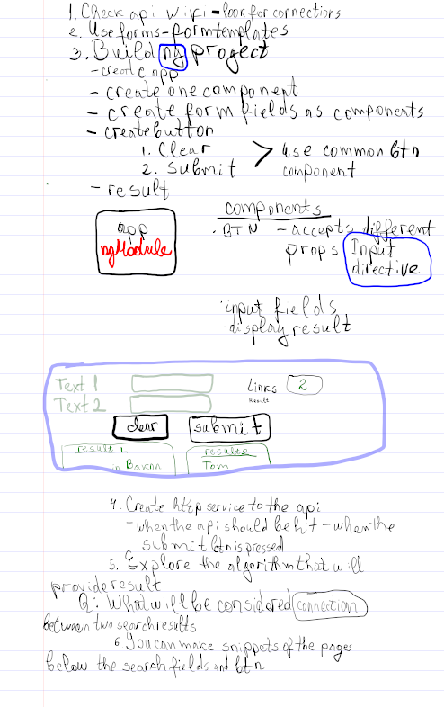

# M2MWikiCountLinks

This project was generated with [Angular CLI](https://github.com/angular/angular-cli) version 18.2.6.

## Development server

Run `ng serve` for a dev server. Navigate to `http://localhost:4200/`. The application will automatically reload if you change any of the source files.

PLEASE REFFER TO `formatting-components` branch for current updates.
THERE ARE MORE THEN ONE BRANCHES. AT THIS TIME THE PROJECT IS NOT READY AND master BRANCH IS THE ONE FROM FRIDAY
